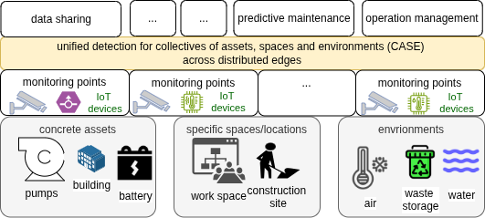

# Fansipan AFS - Analytics Feature Space for Interoperable Edge Machine Learning Detection
>To be updated

AFS supports integrating multiple ML detections from distributed edges in a unified way to address interoperability and explainability for management and downstream applications.



AFS is a key part of [Fansipan](https://github.com/daienso/fansipanpub)

## Overview

This repository provides an implementation of basic AFS schemas, including:

- Feature Instance Schema for encapsulating features from specific pipelines.
- Hierarchical category for annotating the application purposes with the domain information in the detection results.
- Detection configuration change informing the change of the detection pipeline.

These basis schemas can be used for representing and/or enriching detection results. The concept of AFS, examples and experiments, and other implementation details are described in [Analytics Feature Space: a Novel Framework for Interoperable Edge Machine Learning Detection](https://research.aalto.fi/files/146122542/afs.pdf).

## Build the package

To build the package:

```
python -m build
```

Then check the dist directory to see the package

## Reference

If you use the software, you can cite it with the following info:

```
@misc{fansipanafs,
title = "Analytics Feature Space: a Novel Framework for Interoperable Edge Machine Learning Detection",
author = {Hong-Linh Truong and {Nhu Trang}, {Nguyen Ngoc}},
year = "2024",
month = mar,
day = "29",
language = "English",
type = "WorkingPaper",
url={https://research.aalto.fi/files/146122542/afs.pdf}
}
```